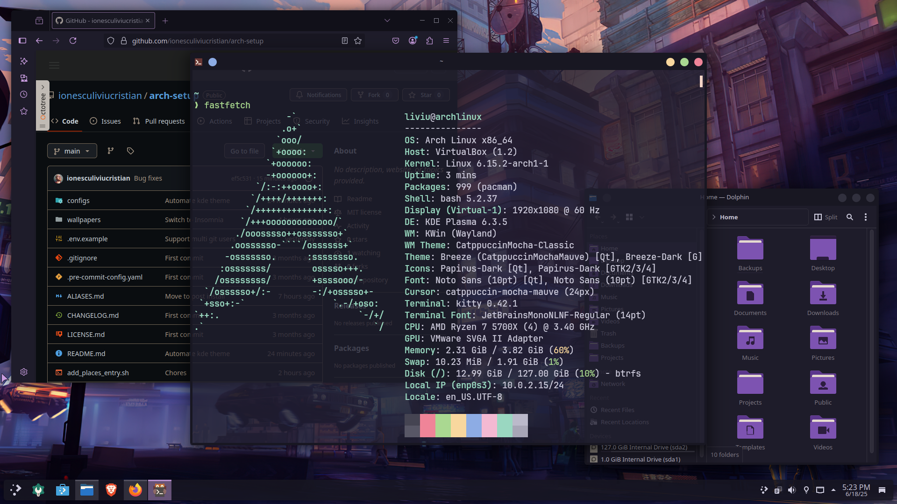

# Arch x64 setup



Wallpapers from [wallpapercave.com](https://wallpapercave.com/)

## Installation

```bash
./install_hardware_b450-i-aorus-pro-wifi.sh | tee install_hardware.log
./install.sh 2>&1 | tee install.log
./post_install.sh your-email@example.com | tee post_install.log

./scripts/check.sh
```

Update manually installed packages

```bash
./scripts/update.sh
```

## Official Arch packages

- [Atuin](https://atuin.sh): Magical shell history [Source](https://github.com/atuinsh/atuin)
- [base-devel](https://archlinux.org/packages/core/any/base-devel): Basic tools to build Arch Linux packages
- [bash-completion](https://github.com/scop/bash-completion): Programmable completion functions for bash
- [bat](https://github.com/sharkdp/bat): A cat(1) clone with wings
- [Blender](https://www.blender.org): The free and open source 3D creation suite
- [broot](https://dystroy.org/broot): A new way to see and navigate directory trees
- [Btop++](https://github.com/aristocratos/btop): A monitor of resources
- [direnv](https://direnv.net): direnv is an extension for your shell. It augments existing shells with a new feature that can load and unload environment variables depending on the current directory
- [DKMS](https://github.com/dell/dkms): Dynamic Kernel Modules System
- [dnsmasq](https://thekelleys.org.uk/dnsmasq/doc.html): Provides network infrastructure for small networks: DNS, DHCP, router advertisement and network boot
- [Docker](https://www.docker.com): An open platform for developing, shipping, and running applications
- [Docker Compose](https://github.com/docker/compose): Define and run multi-container applications with Docker
- [expac](https://github.com/falconindy/expac): alpm data extraction utility
- [eza](https://github.com/eza-community/eza): A modern alternative to ls
- [fastfetch](https://github.com/fastfetch-cli/fastfetch): A maintained, feature-rich and performance oriented, neofetch like system information tool
- [fd](https://github.com/sharkdp/fd): A simple, fast and user-friendly alternative to 'find'
- [Filezilla](https://filezilla-project.org): The free FTP solution
- [Firefox](https://www.mozilla.org/en-US/firefox): A free, Open Source web browser
- [fzf](https://github.com/junegunn/fzf): A command-line fuzzy finder
- [Gimp](https://www.gimp.org): The Free & Open Source Image Editor
- [git](https://git-scm.com): A free and open source distributed version control system designed to handle everything from small to very large projects with speed and efficiency
- [go-yq](https://github.com/mikefarah/yq): yq is a portable command-line YAML, JSON, XML, CSV, TOML and properties processor
- [jq](https://github.com/jqlang/jq): Command-line JSON processor [Source](https://github.com/jqlang/jq)
- [KCalc](https://apps.kde.org/kcalc): KCalc has everything you would expect from a scientific calculator
- [KDE Partition Manager](https://apps.kde.org/partitionmanager): KDE Partition Manager is a utility to help you manage the disks, partitions, and file systems on your computer
- [kitty](https://sw.kovidgoyal.net/kitty/index.html): The fast, feature-rich, GPU based terminal emulator
- [kpackage](https://archlinux.org/packages/extra/x86_64/kpackage): Framework that lets applications manage user installable packages of non-binary assets
- [Krita](https://krita.org/en): A professional FREE and open source painting program
- [lazygit](https://github.com/jesseduffield/lazygit): Simple terminal UI for git commands
- [less](https://www.greenwoodsoftware.com/less): Less is a free, open-source file pager
- [LibreOffice](https://www.libreoffice.org): A private, free and open source office suite
- [Linux headers](https://archlinux.org/packages/core/x86_64/linux-headers): Headers and scripts for building modules for the Linux kernel
- [Linux LTS headers](https://archlinux.org/packages/core/x86_64/linux-lts-headers): Headers and scripts for building modules for the LTS Linux kernel
- [lsof](https://github.com/lsof-org/lsof): LiSt Open Files
- [man-db](https://gitlab.com/man-db/man-db): Tools for reading manual pages [Source](https://gitlab.com/man-db/man-db)
- [mkcert](https://github.com/FiloSottile/mkcert): A simple zero-config tool to make locally trusted development certificates with any names you'd like
- [ncdu](https://dev.yorhel.nl/ncdu): Disk usage analyzer with an ncurses interface
- [neovim](https://neovim.io): Hyperextensible Vim-based text editor
- [net-tools](https://sourceforge.net/projects/net-tools): The collection of base networking utilities for Linux
- [Network Security Services (NSS)](https://firefox-source-docs.mozilla.org/security/nss/index.html): Network Security Services (NSS) is a set of libraries designed to support cross-platform development of security-enabled client and server applications
- [NTFS-3G](https://github.com/tuxera/ntfs-3g): NTFS-3G Safe Read/Write NTFS Driver
- [nvtop](https://github.com/Syllo/nvtop): GPU & Accelerator process monitoring for AMD, Apple, Huawei, Intel, NVIDIA and Qualcomm
- [OBS Studio](https://obsproject.com): Free and open source software for video recording and live streaming
- [Plasma X11 session](https://archlinux.org/packages/extra/x86_64/plasma-x11-session): Plasma X11 session [Source](https://archlinux.org/packages/extra/x86_64/plasma-x11-session)
- [qBittorrent](https://www.qbittorrent.org): The qBittorrent project aims to provide an open-source software alternative to µTorrent
- [ripgrep](https://github.com/BurntSushi/ripgrep): ripgrep recursively searches directories for a regex pattern while respecting your gitignore
- [rsync](https://rsync.samba.org): rsync is an open source utility that provides fast incremental file transfer
- [shellcheck](https://github.com/koalaman/shellcheck): ShellCheck, a static analysis tool for shell scripts
- [SMPlayer](https://www.smplayer.info): Free Media Player with built-in codecs
- [solaar](https://pwr-solaar.github.io/Solaar): Solaar is a Linux manager for many Logitech keyboards, mice, and trackpads that connect wirelessly to a USB Unifying, Bolt, Lightspeed, or Nano receiver
- [starship](https://starship.rs): The minimal, blazing-fast, and infinitely customizable prompt for any shell!
- [superfile](https://superfile.netlify.app): superfile is a very fancy and modern terminal file manager that can complete the file operations you need!!
- [Thunderbird](https://www.thunderbird.net/en-US): The email and productivity app that maximizes your freedoms
- [tmux](https://github.com/tmux/tmux): tmux is a terminal multiplexer
- [tmuxp](https://tmuxp.git-pull.com): Session manager for tmux, which allows users to save and load tmux sessions through simple configuration files
- [unzip](https://infozip.sourceforge.net/UnZip.html): UnZip is an extraction utility for archives compressed in .zip format (also called "zipfiles")
- [VirtualBox](https://www.virtualbox.org): VirtualBox is a general-purpose full virtualization software for x86_64 hardware
- [VirtualBox Guest Additions ISO](https://archlinux.org/packages/extra/any/virtualbox-guest-iso): Consist of device drivers and system applications that optimize the guest operating system for better performance and usability
- [VirtualBox Host DKMS](https://archlinux.org/packages/extra/x86_64/virtualbox-host-dkms): VirtualBox Host kernel modules sources
- [zip](https://infozip.sourceforge.net/Zip.html): Zip is a compression and file packaging/archive utility
- [zoxide](https://github.com/ajeetdsouza/zoxide): A smarter cd command. Supports all major shells

## AUR packages

- [Bitwarden](https://bitwarden.com): Bitwarden is the best password manager for securely storing, managing, and sharing sensitive information such as passwords, passkeys, and credit cards [Source](https://github.com/bitwarden)
- [Brave](https://brave.com): The browser that puts you first - Block ads. Save data. And get way faster webpages. Just by switching your browser [Source](https://github.com/brave)
- [Papirus](https://github.com/PapirusDevelopmentTeam/papirus-icon-theme): Pixel perfect icon theme for Linux [Source](https://github.com/PapirusDevelopmentTeam/papirus-icon-theme)
- [Postman](https://www.postman.com): Postman is the single platform for designing, building, and scaling APIs—together [Source](https://github.com/postmanlabs)
- [Spotify](https://spotify.com): Online music streaming service [Source](https://aur.archlinux.org/packages/spotify)
- [tdrop](https://github.com/noctuid/tdrop): A Glorified WM-Independent Dropdown Creator [Source](https://github.com/noctuid/tdrop)
- [Visual Studio Code](https://code.visualstudio.com): Your code editor. Redefined with AI [Source](https://github.com/microsoft/vscode)

## External packages

- [ble.sh](https://github.com/akinomyoga/ble.sh): Bash Line Editor―a line editor written in pure Bash with syntax highlighting, auto suggestions, vim modes, etc. for Bash interactive sessions [Source](https://github.com/akinomyoga/ble.sh)
- [mgitstatus](https://github.com/fboender/multi-git-status): Show uncommitted, untracked and unpushed changes for multiple Git repos [Source](https://github.com/fboender/multi-git-status)
- [Node Version Manager](https://github.com/nvm-sh/nvm): POSIX-compliant bash script to manage multiple active node.js versions [Source](https://github.com/nvm-sh/nvm)
- [Poetry](https://python-poetry.org): Python packaging and dependency management made easy [Source](https://github.com/python-poetry/poetry)
- [Yay](https://github.com/Jguer/yay): Yet another Yogurt - An AUR Helper written in Go [Source](https://github.com/Jguer/yay)

## Hardware / misc

- [AMD microcode](https://archlinux.org/packages/core/any/amd-ucode): Microcode update image for AMD CPUs [Source](https://gitlab.com/kernel-firmware/linux-firmware)
- [NVIDIA utils (32-bit)](http://www.nvidia.com): NVIDIA drivers utilities (32-bit) [Source](https://archlinux.org/packages/multilib/x86_64/lib32-nvidia-utils)
- [NVIDIA Container Toolkit](https://www.nvidia.com): The NVIDIA Container Toolkit is a collection of libraries and utilities enabling users to build and run GPU-accelerated containers [Source](https://archlinux.org/packages/extra/x86_64/nvidia-container-toolkit)
- [NVIDIA open DKMS](https://www.nvidia.com): NVIDIA open kernel modules - module sources [Source](https://archlinux.org/packages/extra/x86_64/nvidia-open-dkms)
- [NVIDIA settings](https://www.nvidia.com): Tool for configuring the NVIDIA graphics driver [Source](https://archlinux.org/packages/extra/x86_64/nvidia-settings)
- [NVIDIA utils](https://www.nvidia.com): NVIDIA drivers utilities [Source](https://archlinux.org/packages/extra/x86_64/nvidia-utils)

## Available aliases

For a list off all available aliases, [read more here](./ALIASES.md) or run `aliases` after installation

## Firefox plugins

- [Linkclump for Firefox](https://addons.mozilla.org/en-US/firefox/addon/linkclump-for-firefox): Lets you open, copy or bookmark multiple links at the same time

### Interface (Firefox)

- [Bonjourr · Minimalist and lightweight startpage](https://addons.mozilla.org/en-US/firefox/addon/bonjourr-startpage): Improve your web browsing experience with Bonjourr, a beautiful, customizable and lightweight homepage inspired by iOS
- [Dark Reader](https://addons.mozilla.org/en-US/firefox/addon/darkreader): Dark mode for every website
- [Firefox Color](https://addons.mozilla.org/en-US/firefox/addon/firefox-color): Build, save and share beautiful Firefox themes
  - [Catppuccin Mocha - Mauve](https://addons.mozilla.org/en-US/firefox/addon/catppuccin-mocha-mauve-git): Soothing pastel theme for Firefox (Official)
- [Stylus](https://addons.mozilla.org/en-US/firefox/addon/styl-us): Redesign your favorite websites with Stylus, an actively developed and community driven userstyles manager
  - [Catppuccin Userstyles](https://github.com/catppuccin/userstyles/releases/download/all-userstyles-export/import.json): Soothing pastel userstyles

### GitHub (Firefox)

- [Material Icons for GitHub](https://addons.mozilla.org/en-US/firefox/addon/material-icons-for-github): Replace the file/folder icons on github file browsers with icons representing the file's type and which tool it is used by
- [Octotree - GitHub code tree](https://addons.mozilla.org/en-US/firefox/addon/octotree): GitHub on steroids

### Development (Firefox)

- [Google Lighthouse](https://addons.mozilla.org/en-US/firefox/addon/google-lighthouse): Lighthouse is an open-source, automated tool for improving the performance, quality, and correctness of your web apps
- [JSONView](https://addons.mozilla.org/en-US/firefox/addon/jsonview): View JSON documents in the browser
- [React Developer Tools](https://addons.mozilla.org/en-US/firefox/addon/react-devtools): React Developer Tools is a tool that allows you to inspect a React tree, including the component hierarchy, props, state, and more
- [VisBug](https://addons.mozilla.org/en-US/firefox/addon/visbug): DevTools extension for debugging Vue.js applications
- [Vue.js devtools](https://addons.mozilla.org/en-US/firefox/addon/vue-js-devtools): DevTools extension for debugging Vue.js applications

### YouTube (Firefox)

- [Enhancer for YouTube™](https://addons.mozilla.org/en-US/firefox/addon/enhancer-for-youtube): Take control of YouTube and boost your user experience!
- [Return YouTube Dislike](https://addons.mozilla.org/en-US/firefox/addon/return-youtube-dislikes): Returns ability to see dislike statistics on youtube
- [SponsorBlock - Skip Sponsorships on YouTube](https://addons.mozilla.org/en-US/firefox/addon/sponsorblock): Easily skip YouTube video sponsors

### Misc (Firefox)

- [Bitwarden Password Manager](https://addons.mozilla.org/en-US/firefox/addon/bitwarden-password-manager): At home, at work, or on the go, Bitwarden easily secures all your passwords, passkeys, and sensitive information
- [Gesturefy](https://addons.mozilla.org/en-US/firefox/addon/gesturefy): Navigate, operate, and browse faster with mouse gestures!
- [Google Translate](https://addons.mozilla.org/en-US/firefox/addon/google-translate-right-clicks): Google Translate
- [Offline QR Code Generator](https://addons.mozilla.org/en-US/firefox/addon/offline-qr-code-generator): This add-on allows you to quickly generate a QR code offline with the URL of the open tab or any (selected) other text!
- [Plasma Integration](https://addons.mozilla.org/en-US/firefox/addon/plasma-integration): Multitask efficiently by controlling browser functions from the Plasma desktop
- [uBlock Origin](https://addons.mozilla.org/en-US/firefox/addon/ublock-origin): Finally, an efficient wide-spectrum content blocker

## Brave plugins

- [Linkclump](https://chromewebstore.google.com/detail/linkclump/lfpjkncokllnfokkgpkobnkbkmelfefj): Lets you open, copy or bookmark multiple links at the same time

### Interface (Brave)

- [Bonjourr · Minimalist and lightweight startpage](https://chromewebstore.google.com/detail/bonjourr-%C2%B7-minimalist-sta/dlnejlppicbjfcfcedcflplfjajinajd): Improve your web browsing experience with Bonjourr, a beautiful, customizable and lightweight homepage inspired by iOS
- [Catppuccin Chrome Theme - Mocha](https://chromewebstore.google.com/detail/catppuccin-chrome-theme-m/bkkmolkhemgaeaeggcmfbghljjjoofoh): Soothing pastel theme for Google Chrome - Catppuccin Mocha
- [Dark Reader](https://chromewebstore.google.com/detail/dark-reader/eimadpbcbfnmbkopoojfekhnkhdbieeh): Dark mode for every website
- [Stylus](https://chromewebstore.google.com/detail/stylus/clngdbkpkpeebahjckkjfobafhncgmne): Redesign your favorite websites with Stylus, an actively developed and community driven userstyles manager
  - [Catppuccin Userstyles](https://github.com/catppuccin/userstyles/releases/download/all-userstyles-export/import.json): Soothing pastel userstyles

### GitHub (Brave)

- [Material Icons for GitHub](https://chromewebstore.google.com/detail/material-icons-for-github/bggfcpfjbdkhfhfmkjpbhnkhnpjjeomc): Replace the file/folder icons on github file browsers with icons representing the file's type and which tool it is used by
- [Octotree - GitHub code tree](https://chromewebstore.google.com/detail/octotree-github-code-tree/bkhaagjahfmjljalopjnoealnfndnagc): GitHub on steroids

### YouTube (Brave)

- [Enhancer for YouTube™](https://chromewebstore.google.com/detail/enhancer-for-youtube/ponfpcnoihfmfllpaingbgckeeldkhle): Take control of YouTube and boost your user experience!
- [Return YouTube Dislike](https://chromewebstore.google.com/detail/return-youtube-dislike/gebbhagfogifgggkldgodflihgfeippi): Returns ability to see dislike statistics on youtube
- [SponsorBlock for YouTube - Skip Sponsorships](https://chromewebstore.google.com/detail/sponsorblock-for-youtube/mnjggcdmjocbbbhaepdhchncahnbgone): Easily skip YouTube video sponsors

### Misc (Brave)

- [Augmented Steam](https://chromewebstore.google.com/detail/augmented-steam/dnhpnfgdlenaccegplpojghhmaamnnfp): Augmented Steam is a browser extension by IsThereAnyDeal that improves your experience on the Steam platform by providing helpful information and tons of customization options
- [Bitwarden Password Manager](https://chromewebstore.google.com/detail/bitwarden-password-manage/nngceckbapebfimnlniiiahkandclblb): At home, at work, or on the go, Bitwarden easily secures all your passwords, passkeys, and sensitive information
- [CrxMouse: Mouse Gestures](https://chromewebstore.google.com/detail/crxmouse-mouse-gestures/jlgkpaicikihijadgifklkbpdajbkhjo): Boost browsing productivity with mouse gestures! Super Drag, Wheel & more for effortless navigation
- [Google Translate](https://chromewebstore.google.com/detail/google-translate/aapbdbdomjkkjkaonfhkkikfgjllcleb): Google Translate
- [Plasma Integration](https://chromewebstore.google.com/detail/plasma-integration/cimiefiiaegbelhefglklhhakcgmhkai): Multitask efficiently by controlling browser functions from the Plasma desktop
- [Pricy](https://chromewebstore.google.com/detail/pricy/jnpfnacconjipomhfkphknjfmcnhagpb): Pricy is your best friend when buying online
- [QR Code Generator](https://chromewebstore.google.com/detail/qr-code-generator/afpbjjgbdimpioenaedcjgkaigggcdpp): A super handy QR Code Generator

## Development

Install pre commit hooks

```bash
pip install pre-commit
pre-commit install
```

Install kitty terminfo for ssh users that don't have it

```bash
cd ~
curl -O https://raw.githubusercontent.com/kovidgoyal/kitty/master/terminfo/kitty.terminfo
tic -x kitty.terminfo
```
