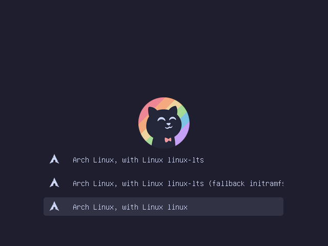

# Arch setup

| [](./assets/preview1.png) | [](./assets/preview2.png) | [](./assets/preview3.png) |
|:------------------------------------------------------------:|:------------------------------------------------------------:|:------------------------------------------------------------:|

Wallpapers from [wallpapercave.com](https://wallpapercave.com/)

## Table of Contents

- [About this project](#about-this-project)
- [Installation](#installation)
- [Profiles](#profiles)
  - [ASUS ExpertBook P1503CVA](#asus-expertbook-p1503cva)
    - [Drivers](#drivers)
  - [B450 I AORUS PRO WIFI](#b450-i-aorus-pro-wifi)
    - [Official Arch packages](#official-arch-packages)
    - [AUR packages](#aur-packages)
    - [Drivers](#drivers-1)
  - [Base](#base)
    - [Official Arch packages](#official-arch-packages-1)
    - [External packages](#external-packages)
    - [AUR packages](#aur-packages-1)
    - [Browser plugins](#browser-plugins)
- [Available aliases](#available-aliases)
- [Import Bitwarden secrets](#import-bitwarden-secrets)
- [Mounts](#mounts)
- [Setup SSH](#setup-ssh)
- [Additional notes](#additional-notes)
- [Development](#development)

## About this project

This is a personal Arch Linux setup designed to streamline the installation and configuration of both general-purpose and workstation-specific environments. It provides a modular, reproducible, and well-documented system tailored for daily productivity, development, and media work.

The repository includes:

- Automated setup scripts for clean installs
- Curated lists of essential Arch, AUR, and external packages
- Workstation-specific configurations (e.g., B450 I AORUS PRO WIFI)
- Theming, aliases, and plugin selections for browsers and terminals
- Support for private dotfiles and secure secrets setup

This project serves as both a starting point and a living reference for managing and maintaining a reliable Arch-based workstation.

## Installation

```bash
# Setup base workstation
./install.sh

# Post reboot setup
./setups/base/post_reboot.sh

# Setup B450 I AORUS PRO WIFI workstation
./install_b450-i-aorus-pro-wifi/install.sh
```


## Profiles

### ASUS ExpertBook P1503CVA

#### Drivers

- [Intel CPU microcode](https://www.intel.com/content/www/us/en/homepage.html): Microcode update files for Intel CPUs
  - [Source](https://github.com/intel/Intel-Linux-Processor-Microcode-Data-Files/)
- [OpenGL drivers](https://www.mesa3d.org/): Open-source OpenGL drivers
  - [Source](https://gitlab.archlinux.org/archlinux/packaging/packages/mesa/)
- [OpenGL drivers (32-bit)](https://www.mesa3d.org/): Open-source OpenGL drivers - 32-bit
  - [Source](https://gitlab.archlinux.org/archlinux/packaging/packages/lib32-mesa/)

### B450 I AORUS PRO WIFI

#### Official Arch packages

- [Ayatana Application Indicator (Shared Library)](): The Ayatana Indicators project is the continuation of Application Indicators and System Indicators, two technologies developed by Canonical Ltd. for the Unity7 desktop
  - [Source](https://github.com/AyatanaIndicators/libayatana-appindicator/)
- [Blender](https://www.blender.org/): The free and open source 3D creation suite
  - [Source](https://github.com/blender/blender/)
- [Gimp](https://www.gimp.org/): The Free & Open Source Image Editor
  - [Source](https://github.com/GNOME/gimp/)
- [Krita](https://krita.org/en/): Krita is a free and open source cross-platform application that offers an end-to-end solution for creating digital art files from scratch built on the KDE and Qt frameworks
  - [Source](https://invent.kde.org/graphics/krita/)
- [OBS Studio](https://obsproject.com/): Free and open source software for video recording and live streaming
  - [Source](https://github.com/obsproject/obs-studio/)
- [Solaar](https://pwr-solaar.github.io/Solaar/): Solaar is a Linux manager for many Logitech keyboards, mice, and trackpads that connect wirelessly to a USB Unifying, Bolt, Lightspeed, or Nano receiver
  - [Source](https://github.com/pwr-Solaar/Solaar/)

#### AUR packages

- [ProFTPD](http://www.proftpd.org/): Highly configurable GPL-licensed FTP server software
  - [Source](https://github.com/proftpd/proftpd/)

#### Drivers

- [AMD CPU microcode](https://www.amd.com/en.html): Microcode update image for AMD CPUs
  - [Source](https://gitlab.com/kernel-firmware/linux-firmware/-/tree/main/amd-ucode?ref_type=heads)
- [OpenGL drivers](https://www.mesa3d.org/): Open-source OpenGL drivers
  - [Source](https://gitlab.archlinux.org/archlinux/packaging/packages/mesa/)
- [OpenGL drivers (32-bit)](https://www.mesa3d.org/): Open-source OpenGL drivers - 32-bit
  - [Source](https://gitlab.archlinux.org/archlinux/packaging/packages/lib32-mesa/)
- [Vulkan driver for AMD GPUs](https://www.mesa3d.org/): Open-source Vulkan driver for AMD GPUs
  - [Source](https://gitlab.archlinux.org/archlinux/packaging/packages/mesa/)
- [Vulkan driver for AMD GPUs (32-bit)](https://www.mesa3d.org/): Open-source Vulkan driver for AMD GPUs - 32-bit
  - [Source](https://gitlab.archlinux.org/archlinux/packaging/packages/lib32-mesa/)
- [XP-Pen utility](https://www.xp-pen.com/): XP-Pen (Official) Linux utility for legacy XPPen Tablets
  - [Source](https://aur.archlinux.org/cgit/aur.git/tree/PKGBUILD?h=xppenlinux-v3)

### Base

#### Official Arch packages

- [Atuin](https://atuin.sh/): Sync, search and backup shell history with Atuin
  - [Source](https://github.com/atuinsh/atuin/)
- [bandwhich](https://archlinux.org/): Terminal bandwidth utilization tool
  - [Source](https://github.com/imsnif/bandwhich/)
- [base-devel](https://archlinux.org/): Basic tools to build Arch Linux packages
  - [Source](https://gitlab.archlinux.org/archlinux/packaging/packages/base-devel/)
- [Bash](https://www.gnu.org/software/bash/): The GNU Bourne Again shell
  - [Source](https://git.savannah.gnu.org/cgit/bash.git/)
- [Bash Language Server](https://github.com/bash-lsp/bash-language-server/): A language server for Bash
  - [Source](https://github.com/bash-lsp/bash-language-server/)
- [bash-completion](https://github.com/scop/bash-completion/): Programmable completion functions for bash
  - [Source](https://github.com/scop/bash-completion/)
- [bat](https://github.com/sharkdp/bat/): A cat(1) clone with wings
  - [Source](https://github.com/sharkdp/bat/)
- [BIND 9](https://www.isc.org/bind/): BIND (Berkeley Internet Name Domain) is a complete, highly portable implementation of the Domain Name System (DNS) protocol
  - [Source](https://gitlab.isc.org/isc-projects/bind9/)
- [Bitwarden](https://bitwarden.com/): Fix at-risk passwords and stay safe online with Bitwarden, the best password manager for securely managing and sharing sensitive information
  - [Source](https://github.com/bitwarden/clients/tree/main/apps/desktop/)
- [Bitwarden CLI](https://bitwarden.com/): The Bitwarden CLI is a powerful, full-featured command-line interface (CLI) tool to access and manage a Bitwarden vault
  - [Source](https://github.com/bitwarden/clients/tree/main/apps/cli/)
- [broot](https://dystroy.org/broot/): Broot is a better way to navigate directories, find files, and launch commands
  - [Source](https://github.com/Canop/broot/)
- [Btop++](https://github.com/aristocratos/btop/): A monitor of resources
  - [Source](https://github.com/aristocratos/btop/)
- [BTRFS tools](https://btrfs.readthedocs.io/en/latest/): Userspace utilities to manage btrfs filesystems
  - [Source](https://github.com/kdave/btrfs-progs/)
- [buildx](https://www.docker.com/): Docker CLI plugin for extended build capabilities with BuildKit
  - [Source](https://github.com/docker/buildx/)
- [D-Bus](https://www.freedesktop.org/wiki/Software/dbus/): D-Bus is a message bus system, a simple way for applications to talk to one another
  - [Source](https://gitlab.freedesktop.org/dbus/dbus.git/)
- [direnv](https://direnv.net/): direnv is an extension for your shell. It augments existing shells with a new feature that can load and unload environment variables depending on the current directory
  - [Source](https://github.com/direnv/direnv/)
- [dive](https://github.com/wagoodman/dive/): A tool for exploring each layer in a docker image
  - [Source](https://github.com/wagoodman/dive/)
- [DKMS](https://github.com/dell/dkms/): Dynamic Kernel Modules System
  - [Source](https://github.com/dell/dkms/)
- [Docker](https://www.docker.com/): The Docker CLI
  - [Source](https://github.com/docker/cli/)
- [Docker Compose](https://www.docker.com/): Define and run multi-container applications with Docker
  - [Source](https://github.com/docker/compose/)
- [ExifTool](https://exiftool.org/): Read, Write and Edit Meta Information!
  - [Source](https://github.com/exiftool/exiftool/)
- [expac](https://github.com/falconindy/expac/): alpm data extraction utility
  - [Source](https://github.com/falconindy/expac/)
- [eza](https://eza.rocks/): A modern alternative to ls
  - [Source](https://github.com/eza-community/eza/)
- [fastfetch](https://github.com/fastfetch-cli/fastfetch/): A maintained, feature-rich and performance oriented, neofetch like system information tool
  - [Source](https://github.com/fastfetch-cli/fastfetch/)
- [fd](https://github.com/sharkdp/fd/): A simple, fast and user-friendly alternative to 'find'
  - [Source](https://github.com/sharkdp/fd/)
- [FileZilla](https://filezilla-project.org/): The free FTP solution
  - [Source](https://svn.filezilla-project.org/svn/FileZilla3/trunk/)
- [Firefox](https://www.mozilla.org/en-US/firefox/): A free, Open Source web browser
  - [Source](https://github.com/mozilla-firefox/firefox/)
- [fzf](https://junegunn.github.io/fzf/): A command-line fuzzy finder
  - [Source](https://github.com/junegunn/fzf/)
- [git](https://git-scm.com/): A free and open source distributed version control system designed to handle everything from small to very large projects with speed and efficiency
  - [Source](https://github.com/git/git/)
- [GitHub CLI](https://cli.github.com/): GitHub's official command line tool
  - [Source](https://github.com/cli/cli/)
- [Go](https://go.dev/): Build simple, secure, scalable systems with Go
  - [Source](https://github.com/golang/go/)
- [go-yq](https://mikefarah.gitbook.io/yq/): A lightweight and portable command-line YAML, JSON, INI and XML processor
  - [Source](https://github.com/mikefarah/yq/)
- [GRUB](https://www.gnu.org/software/grub/): GNU GRand Unified Bootloader (2)
  - [Source](https://git.savannah.gnu.org/cgit/grub.git)
- [Gwenview](https://apps.kde.org/gwenview/): Image viewer by KDE
  - [Source](https://invent.kde.org/graphics/gwenview/)
- [ImageMagick](https://imagemagick.org/): ImageMagick is a free, open-source software suite, used for editing and manipulating digital images
  - [Source](https://github.com/imagemagick/imagemagick/)
- [jq](https://jqlang.org/): jq is a lightweight and flexible command-line JSON processor
  - [Source](https://github.com/jqlang/jq/)
- [KCalc](https://apps.kde.org/kcalc/): KCalc has everything you would expect from a scientific calculator
  - [Source](https://invent.kde.org/utilities/kcalc/)
- [KDE Partition Manager](https://apps.kde.org/partitionmanager/): KDE Partition Manager is a utility to help you manage the disks, partitions, and file systems on your computer
  - [Source](https://github.com/KDE/partitionmanager/)
- [kitty](https://sw.kovidgoyal.net/kitty/index.html): The fast, feature-rich, GPU based terminal emulator
  - [Source](https://github.com/kovidgoyal/kitty/)
- [Konsole](https://konsole.kde.org/): Terminal emulator by KDE
  - [Source](https://github.com/KDE/konsole/)
- [kpackage](https://invent.kde.org/frameworks/kpackage/): This framework lets applications to manage user installable packages of non-binary assets
  - [Source](https://invent.kde.org/frameworks/kpackage/)
- [KScreenLocker](https://kde.org/): Library and components for secure lock screen architecture
  - [Source](https://invent.kde.org/plasma/kscreenlocker/)
- [lazygit](https://github.com/jesseduffield/lazygit/): Simple terminal UI for git commands
  - [Source](https://github.com/jesseduffield/lazygit/)
- [less](https://www.greenwoodsoftware.com/less/): Less is a free, open-source file pager
  - [Source](https://github.com/gwsw/less/)
- [LibreOffice](https://www.libreoffice.org/): LibreOffice is a private, free and open source office suite
  - [Source](https://github.com/libreoffice/)
- [lsof](https://lsof.readthedocs.io/): LiSt Open Files
  - [Source](https://github.com/lsof-org/lsof/)
- [man-db](https://gitlab.com/man-db/man-db/): Tools for reading manual pages
  - [Source](https://gitlab.com/man-db/man-db/)
- [man-pages](https://www.kernel.org/doc/man-pages/): The Linux man-pages project documents the Linux kernel and C library interfaces that are employed by user-space programs
  - [Source](https://git.kernel.org/pub/scm/docs/man-pages/man-pages.git/)
- [mkcert](https://mkcert.dev/): A simple zero-config tool to make locally trusted development certificates with any names you'd like
  - [Source](https://github.com/FiloSottile/mkcert/)
- [NCurses Disk Usage](https://dev.yorhel.nl/ncdu/): Ncdu is a disk usage analyzer with a text-mode user interface
  - [Source](https://g.blicky.net/ncdu.git/)
- [neovim](https://neovim.io): Hyperextensible Vim-based text editor
  - [Source](https://github.com/neovim/neovim)
- [net-tools](https://net-tools.sourceforge.io/): net-tools, the collection of base networking utilities for Linux
  - [Source](https://sourceforge.net/p/net-tools/code/ci/master/tree/)
- [Network Security Services (NSS)](https://firefox-source-docs.mozilla.org/security/nss/index.html): Network Security Services (NSS) is a set of libraries designed to support cross-platform development of security-enabled client and server applications
  - [Source](https://gitlab.archlinux.org/archlinux/packaging/packages/nss/)
- [Nmap](https://nmap.org/): Nmap ("Network Mapper") is a free and open source utility for network discovery and security auditing
  - [Source](https://github.com/nmap/nmap/)
- [Node Version Manager](): Node Version Manager - POSIX-compliant bash script to manage multiple active node.js versions
  - [Source](https://github.com/nvm-sh/nvm/)
- [Noto fonts](https://fonts.google.com/noto/): Noto: A typeface for the world
  - [Source](https://gitlab.archlinux.org/archlinux/packaging/packages/noto-fonts/)
- [Noto fonts](https://fonts.google.com/noto/): Noto: A typeface for the world
  - [Source](https://gitlab.archlinux.org/archlinux/packaging/packages/noto-fonts-cjk/)
- [Noto fonts](https://fonts.google.com/noto/): Noto: A typeface for the world
  - [Source](https://gitlab.archlinux.org/archlinux/packaging/packages/noto-fonts-emoji)
- [Noto fonts](https://fonts.google.com/noto/): Noto: A typeface for the world
  - [Source](https://gitlab.archlinux.org/archlinux/packaging/packages/noto-fonts/)
- [NTFS-3G](https://www.tuxera.com/): NTFS-3G Safe Read/Write NTFS Driver
  - [Source](https://github.com/tuxera/ntfs-3g/)
- [nvtop](): GPU & Accelerator process monitoring for AMD, Apple, Huawei, Intel, NVIDIA and Qualcomm
  - [Source](https://github.com/Syllo/nvtop/)
- [Okular](https://apps.kde.org/okular/): Okular is a universal document viewer developed by KDE. Okular works on multiple platforms, including but not limited to Linux, Windows, Mac OS X, *BSD, etc.
  - [Source](https://gitlab.archlinux.org/archlinux/packaging/packages/okular/)
- [OpenPrinting CUPS](https://openprinting.github.io/cups/): The current standards-based, open source printing system developed by OpenPrinting for Linux® and other Unix®-like operating systems
  - [Source](https://github.com/openprinting/cups/)
- [OpenSSH](https://www.openssh.com/): SSH protocol implementation for remote login, command execution and file transfer
  - [Source](https://github.com/openssh/openssh-portable/)
- [pacman](https://archlinux.org/pacman/): A library-based package manager with dependency support
  - [Source](https://gitlab.archlinux.org/pacman/pacman/)
- [pacman-contrib](): Contributed scripts and tools for pacman systems
  - [Source](https://gitlab.archlinux.org/pacman/pacman-contrib/)
- [pigz](https://www.zlib.net/pigz/): A parallel implementation of gzip for modern multi-processor, multi-core machines
  - [Source](https://github.com/madler/pigz/)
- [pip](https://pip.pypa.io/en/stable/): pip is the package installer for Python
  - [Source](https://github.com/pypa/pip/)
- [pipx](https://pipx.pypa.io/): Install and Run Python Applications in Isolated Environments
  - [Source](https://github.com/pypa/pipx/)
- [Plasma X11 session](https://kde.org/plasma-desktop/): Plasma X11 session
  - [Source](https://invent.kde.org/plasma/plasma-desktop/)
- [plocate](https://plocate.sesse.net/): plocate is a locate(1) based on posting lists, completely replacing mlocate with a much faster (and smaller) index
  - [Source](https://git.sesse.net/?p=plocate)
- [pnpm](https://pnpm.io/): Get lightning-fast installation speeds and a smarter, safer way to manage dependencies
  - [Source](https://github.com/pnpm/pnpm/)
- [Poetry](https://python-poetry.org/): Python packaging and dependency management made easy
  - [Source](https://github.com/python-poetry/poetry/)
- [procs](): A modern replacement for ps written in Rust
  - [Source](https://github.com/dalance/procs/)
- [pyenv](): Simple Python version management
  - [Source](https://github.com/pyenv/pyenv/)
- [qBittorrent](https://www.qbittorrent.org/): The qBittorrent project aims to provide an open-source software alternative to µTorrent
  - [Source](https://github.com/qbittorrent/qBittorrent/)
- [reflector](https://xyne.dev/projects/reflector/): A Python 3 module and script to retrieve and filter the latest Pacman mirror list
  - [Source](https://xyne.dev/projects/reflector/src/)
- [ripgrep](): ripgrep recursively searches directories for a regex pattern while respecting your gitignore
  - [Source](https://github.com/BurntSushi/ripgrep/)
- [rsync](https://rsync.samba.org/): rsync is an open source utility that provides fast incremental file transfer
  - [Source](https://github.com/RsyncProject/rsync/)
- [rustup](https://rust-lang.github.io/rustup/): rustup installs The Rust Programming Language from the official release channels, enabling you to easily switch between stable, beta, and nightly compilers and keep them updated
  - [Source](https://github.com/rust-lang/rustup/)
- [SDDM](): QML based X11 and Wayland display manager
  - [Source](https://github.com/sddm/sddm/)
- [sh](https://pkg.go.dev/mvdan.cc/sh/v3/): A shell parser, formatter, and interpreter with bash support; includes shfmt
  - [Source](https://github.com/mvdan/sh/)
- [ShellCheck](https://www.shellcheck.net/): Finds bugs in your shell scripts.
  - [Source](https://github.com/koalaman/shellcheck/)
- [shtab](https://docs.iterative.ai/shtab/): Automagic shell tab completion for Python CLI applications
  - [Source](https://github.com/iterative/shtab/)
- [SMPlayer](https://www.smplayer.info/): Free Media Player with built-in codecs
  - [Source](https://github.com/smplayer-dev/smplayer/)
- [Starship](https://starship.rs/): The minimal, blazing-fast, and infinitely customizable prompt for any shell!
  - [Source](https://github.com/starship/starship/)
- [superfile](https://superfile.dev/): superfile is a very fancy and modern terminal file manager that can complete the file operations you need!!
  - [Source](https://github.com/yorukot/superfile/)
- [Thunderbird](https://www.thunderbird.net/): Free Your Inbox - Meet Thunderbird, the email and productivity app that maximizes your freedoms
  - [Source](https://github.com/thunderbird/)
- [Tk toolkit](https://core.tcl-lang.org/index.html): Tk is a GUI toolkit for Tcl
  - [Source](https://core.tcl-lang.org/tk/timeline?y=ci)
- [tldr](https://pypi.org/project/tldr/): Command line client for tldr, a collection of simplified man pages
  - [Source](https://github.com/tldr-pages/tldr-python-client/)
- [tmux](): tmux is a terminal multiplexer: it enables a number of terminals to be created, accessed, and controlled from a single screen. tmux may be detached from a screen and continue running in the background, then later reattached
  - [Source](https://github.com/tmux/tmux/)
- [tmuxp](https://tmuxp.git-pull.com/): Session manager for tmux, which allows users to save and load tmux sessions through simple configuration files
  - [Source](https://github.com/tmux-python/tmuxp/)
- [unrar](https://www.rarlab.com/rar_add.htm): Library and header file for applications that use libunrar
  - [Source](https://gitlab.archlinux.org/archlinux/packaging/packages/unrar/)
- [UnZip](https://infozip.sourceforge.net/UnZip.html): UnZip is an extraction utility for archives compressed in .zip format (also called 'zipfiles')
  - [Source](http://infozip.sourceforge.net/UnZip.html)
- [usbutils](https://gitlab.archlinux.org/archlinux/packaging/packages/usbutils/): A collection of USB tools to query connected USB devices
  - [Source](https://git.kernel.org/pub/scm/linux/kernel/git/gregkh/usbutils.git/)
- [Vim](https://www.vim.org/): Vim is a highly configurable text editor built to make creating and changing any kind of text very efficient. It is included as "vi" with most UNIX systems and with Apple OS X
  - [Source](https://github.com/vim/vim/)
- [VirtualBox](https://www.virtualbox.org/): VirtualBox is a general-purpose full virtualization software for x86_64 hardware
  - [Source](https://github.com/Virtualbox-OSE/)
- [VirtualBox Guest Additions ISO](https://www.virtualbox.org/): Consist of device drivers and system applications that optimize the guest operating system for better performance and usability
  - [Source](https://gitlab.archlinux.org/archlinux/packaging/packages/virtualbox-guest-iso/)
- [VirtualBox Host DKMS](https://www.virtualbox.org/): VirtualBox Host kernel modules sources
  - [Source](https://gitlab.archlinux.org/archlinux/packaging/packages/virtualbox/)
- [xclip](https://github.com/astrand/xclip/): Command line interface to the X11 clipboard
  - [Source](https://github.com/astrand/xclip/)
- [XMLStarlet](https://xmlstar.sourceforge.net/): XMLStarlet is a set of command line utilities (tools) which can be used to transform, query, validate, and edit XML documents and files
  - [Source](https://sourceforge.net/p/xmlstar/code/ci/master/tree/)
- [Zip](https://infozip.sourceforge.net/Zip.html): Zip is a compression and file packaging/archive utility
  - [Source](https://infozip.sourceforge.net/Zip.html)
- [zoxide](https://crates.io/crates/zoxide/): A smarter cd command. Supports all major shells
  - [Source](https://github.com/ajeetdsouza/zoxide/)

#### External packages

- [Miniconda](https://docs.anaconda.com/miniconda/): Miniconda is a free, miniature installation of Anaconda Distribution that includes only conda, Python, the packages they both depend on, and a small number of other useful packages
  - [Source](https://github.com/conda/conda/)
- [Yay](): Yet another Yogurt - An AUR Helper written in Go
  - [Source](https://github.com/Jguer/yay/)

#### AUR packages

- [ble.sh](https://github.com/akinomyoga/ble.sh): Bash Line Editor―a line editor written in pure Bash with syntax highlighting, auto suggestions, vim modes, etc. for Bash interactive sessions
  - [Source](https://github.com/akinomyoga/ble.sh)
- [Brave](https://brave.com/): The browser that puts you first - Block ads. Save data. And get way faster webpages. Just by switching your browser
  - [Source](https://github.com/brave/brave-browser/)
- [downgrade](https://archlinux-downgrade.github.io/downgrade/): Downgrade packages in Arch Linux
  - [Source](https://github.com/archlinux-downgrade/downgrade/)
- [gita](https://github.com/nosarthur/gita/): Manage many git repos with sanity
  - [Source](https://github.com/nosarthur/gita)
- [NordVPN](https://nordvpn.com/): The best VPN service for a free, open internet
  - [Source](https://nordvpn.com/)
- [NordVPN GUI](https://nordvpn.com/): NordVPN Linux client
  - [Source](https://github.com/NordSecurity/nordvpn-linux/)
- [OneDrive](https://abraunegg.github.io/): OneDrive Client for Linux
  - [Source](https://github.com/abraunegg/onedrive/)
- [OneDriveGUI](https://github.com/bpozdena/OneDriveGUI/): A simple GUI for OneDrive Linux client with multi-account support
  - [Source](https://github.com/bpozdena/OneDriveGUI/)
- [Papirus](https://store.kde.org/p/1166289/): Pixel perfect icon theme for Linux
  - [Source](https://github.com/PapirusDevelopmentTeam/papirus-icon-theme/)
- [Papirus Folders](): A script that lets you change the colors of folders in Papirus icon theme
  - [Source](https://github.com/PapirusDevelopmentTeam/papirus-folders/)
- [Postman](https://www.postman.com/): Unify API design, testing, documentation, monitoring, and discovery on one platform that integrates with the rest of your stack, including every major gateway and Git solution
  - [Source](https://github.com/postmanlabs/)
- [tdrop](): A Glorified WM-Independent Dropdown Creator
  - [Source](https://github.com/noctuid/tdrop/)
- [Visual Studio Code](https://code.visualstudio.com/): Your code editor. Redefined with AI
  - [Source](https://github.com/microsoft/vscode/)
- [Zoom](https://www.zoom.com/): Video Conferencing and Web Conferencing Service
  - [Source](https://github.com/zoom/)

#### Browser plugins

##### Brave plugins

###### Interface

- [Catppuccin Chrome Theme - Mocha](https://chromewebstore.google.com/detail/catppuccin-chrome-theme-m/bkkmolkhemgaeaeggcmfbghljjjoofoh): Soothing pastel theme for Google Chrome - Catppuccin Mocha
- [Stylus](https://chromewebstore.google.com/detail/stylus/clngdbkpkpeebahjckkjfobafhncgmne): Redesign your favorite websites with Stylus, an actively developed and community driven userstyles manager
  - [Catppuccin Userstyles](https://github.com/catppuccin/userstyles/releases/download/all-userstyles-export/import.json): Soothing pastel userstyles

###### GitHub

- [Material Icons for GitHub](https://chromewebstore.google.com/detail/material-icons-for-github/bggfcpfjbdkhfhfmkjpbhnkhnpjjeomc): Replace the file/folder icons on github file browsers with icons representing the file's type and which tool it is used by
- [Octotree - GitHub code tree](https://chromewebstore.google.com/detail/octotree-github-code-tree/bkhaagjahfmjljalopjnoealnfndnagc): GitHub on steroids

###### YouTube

- [Enhancer for YouTube™](https://chromewebstore.google.com/detail/enhancer-for-youtube/ponfpcnoihfmfllpaingbgckeeldkhle): Take control of YouTube and boost your user experience!
- [Return YouTube Dislike](https://chromewebstore.google.com/detail/return-youtube-dislike/gebbhagfogifgggkldgodflihgfeippi): Returns ability to see dislike statistics on youtube
- [SponsorBlock for YouTube - Skip Sponsorships](https://chromewebstore.google.com/detail/sponsorblock-for-youtube/mnjggcdmjocbbbhaepdhchncahnbgone): Easily skip YouTube video sponsors

###### Misc

- [Augmented Steam](https://chromewebstore.google.com/detail/augmented-steam/dnhpnfgdlenaccegplpojghhmaamnnfp): Augmented Steam is a browser extension by IsThereAnyDeal that improves your experience on the Steam platform by providing helpful information and tons of customization options
- [Bitwarden Password Manager](https://chromewebstore.google.com/detail/bitwarden-password-manage/nngceckbapebfimnlniiiahkandclblb): At home, at work, or on the go, Bitwarden easily secures all your passwords, passkeys, and sensitive information
- [CrxMouse: Mouse Gestures](https://chromewebstore.google.com/detail/crxmouse-mouse-gestures/jlgkpaicikihijadgifklkbpdajbkhjo): Boost browsing productivity with mouse gestures! Super Drag, Wheel & more for effortless navigation
- [Google Translate](https://chromewebstore.google.com/detail/google-translate/aapbdbdomjkkjkaonfhkkikfgjllcleb): Google Translate
- [Plasma Integration](https://chromewebstore.google.com/detail/plasma-integration/cimiefiiaegbelhefglklhhakcgmhkai): Multitask efficiently by controlling browser functions from the Plasma desktop
- [Pricy](https://chromewebstore.google.com/detail/pricy/jnpfnacconjipomhfkphknjfmcnhagpb): Pricy is your best friend when buying online
- [QR Code Generator](https://chromewebstore.google.com/detail/qr-code-generator/afpbjjgbdimpioenaedcjgkaigggcdpp): A super handy QR Code Generator
- [Vimium](https://chromewebstore.google.com/detail/vimium/dbepggeogbaibhgnhhndojpepiihcmeb): The Hacker's Browser. Vimium provides keyboard shortcuts for navigation and control in the spirit of Vim.

##### Firefox plugins

###### Interface

- [Firefox Color](https://addons.mozilla.org/en-US/firefox/addon/firefox-color): Build, save and share beautiful Firefox themes
  - [Catppuccin Mocha - Mauve](https://addons.mozilla.org/en-US/firefox/addon/catppuccin-mocha-mauve-git): Soothing pastel theme for Firefox (Official)
- [Stylus](https://addons.mozilla.org/en-US/firefox/addon/styl-us): Redesign your favorite websites with Stylus, an actively developed and community driven userstyles manager
  - [Catppuccin Userstyles](https://github.com/catppuccin/userstyles/releases/download/all-userstyles-export/import.json): Soothing pastel userstyles

###### GitHub

- [Material Icons for GitHub](https://addons.mozilla.org/en-US/firefox/addon/material-icons-for-github): Replace the file/folder icons on github file browsers with icons representing the file's type and which tool it is used by
- [Octotree - GitHub code tree](https://addons.mozilla.org/en-US/firefox/addon/octotree): GitHub on steroids

###### Development

- [Google Lighthouse](https://addons.mozilla.org/en-US/firefox/addon/google-lighthouse): Lighthouse is an open-source, automated tool for improving the performance, quality, and correctness of your web apps
- [JSONView](https://addons.mozilla.org/en-US/firefox/addon/jsonview): View JSON documents in the browser
- [React Developer Tools](https://addons.mozilla.org/en-US/firefox/addon/react-devtools): React Developer Tools is a tool that allows you to inspect a React tree, including the component hierarchy, props, state, and more
- [VisBug](https://addons.mozilla.org/en-US/firefox/addon/visbug): DevTools extension for debugging Vue.js applications
- [Vue.js devtools](https://addons.mozilla.org/en-US/firefox/addon/vue-js-devtools): DevTools extension for debugging Vue.js applications

###### YouTube

- [Enhancer for YouTube™](https://addons.mozilla.org/en-US/firefox/addon/enhancer-for-youtube): Take control of YouTube and boost your user experience!
- [Return YouTube Dislike](https://addons.mozilla.org/en-US/firefox/addon/return-youtube-dislikes): Returns ability to see dislike statistics on youtube
- [SponsorBlock - Skip Sponsorships on YouTube](https://addons.mozilla.org/en-US/firefox/addon/sponsorblock): Easily skip YouTube video sponsors

###### Misc

- [Bitwarden Password Manager](https://addons.mozilla.org/en-US/firefox/addon/bitwarden-password-manager): At home, at work, or on the go, Bitwarden easily secures all your passwords, passkeys, and sensitive information
- [Gesturefy](https://addons.mozilla.org/en-US/firefox/addon/gesturefy): Navigate, operate, and browse faster with mouse gestures!
- [Google Translate](https://addons.mozilla.org/en-US/firefox/addon/google-translate-right-clicks): Google Translate
- [Offline QR Code Generator](https://addons.mozilla.org/en-US/firefox/addon/offline-qr-code-generator): This add-on allows you to quickly generate a QR code offline with the URL of the open tab or any (selected) other text!
- [Plasma Integration](https://addons.mozilla.org/en-US/firefox/addon/plasma-integration): Multitask efficiently by controlling browser functions from the Plasma desktop
- [uBlock Origin](https://addons.mozilla.org/en-US/firefox/addon/ublock-origin): Finally, an efficient wide-spectrum content blocker
- [Vimium](https://addons.mozilla.org/en-US/firefox/addon/vimium-ff): The Hacker's Browser. Vimium provides keyboard shortcuts for navigation and control in the spirit of Vim.

## Available aliases

For a list off all available aliases, [read more here](./docs/ALIASES.md) or run `aliases` after installation

## Import Bitwarden secrets

```bash
# Make sure you understand what this setup does before running it
./setups/base/secrets.sh bitwarden@mail.com
./setups/base/official/git.sh
```

## Mounts

```bash
# Mounts should be used only when `mounts.json` is configured
./setups/base/mounts.sh
./setups/base/aur/onedrive.sh
./setups/base/aur/onedrive-gui.sh
```

## Setup SSH

```bash
# Make sure you understand what this setup does before running it
./setups/base/system/ssh.sh
```

## Additional notes

Install kitty terminfo on the remote server when connecting via SSH

```bash
cd ~
curl -O https://raw.githubusercontent.com/kovidgoyal/kitty/master/terminfo/kitty.terminfo
tic -x kitty.terminfo
```

## Development

```bash
npm i
```

### VirtualBox setup

#### Host

```bash
vm="arch"

vm_dir="$(VBoxManage showvminfo "${vm}" --machinereadable | grep CfgFile | cut -d'"' -f2 | xargs dirname)" 

serial="WGS3TEKD"

VBoxManage createmedium disk --filename "${vm_dir}/hdd.vdi" --size 20480

VBoxManage storageattach "${vm}" \
  --storagectl "SATA" \
  --port 1 \
  --type hdd \
  --medium "${vm_dir}/hdd.vdi"

VBoxManage setextradata "${vm}" \
  "VBoxInternal/Devices/ahci/0/Config/Port1/SerialNumber" \
  "${serial}"
```

#### Guest

```bash
sudo pacman -Syu git firefox virtualbox-guest-utils
sudo systemctl enable --now vboxservice.service
sudo usermod -aG vboxsf "${USER}"

sudo parted /dev/sdb mklabel gpt
sudo parted /dev/sdb mkpart primary ntfs 0% 100%

sudo mkfs.ntfs -f /dev/sdb1

lsblk -no NAME,SERIAL

# Create after the HDD is mounted
mkdir -p "/mnt/hdd/Tests/Books/"
mkdir -p "/mnt/hdd/Tests/Pictures/"
```
